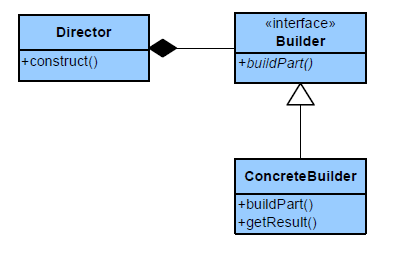

###Builder

Separate the construction of a complex object from its representation so that
the same construction process can create different representations.

#####Applicability
Use the Builder pattern when
 - the algorithm for creating a complex object should be independent of the
parts that make up the object and how they're assembled.
 - the construction process must allow different representations for the
object that's constructed.

#####Consequences
Here are key consequences of the Builder pattern:
1. **It lets you vary a product's internal representation.** -> The Builder object
   provides the director with an abstract interface for constructing the
   product. The interface lets the builder hide the representation and internal
   structure of the product. It also hides how the product gets assembled.

2. **It isolates code for construction and representation.** -> The Builder pattern
   improves modularity by encapsulating the way a complex object is constructed
   and represented. Clients needn't know anything about the classes that define
   the product's internal structure; such classes don't appear in Builder's
   interface. 

3. **It gives you finer control over the construction process.** -> Unlike creational
   patterns that construct products in one shot, the Builder pattern constructs the product step by step under the director's control.

##### O from SOLID
O - Open-Closed principle (Open for extension, closed for modification)
