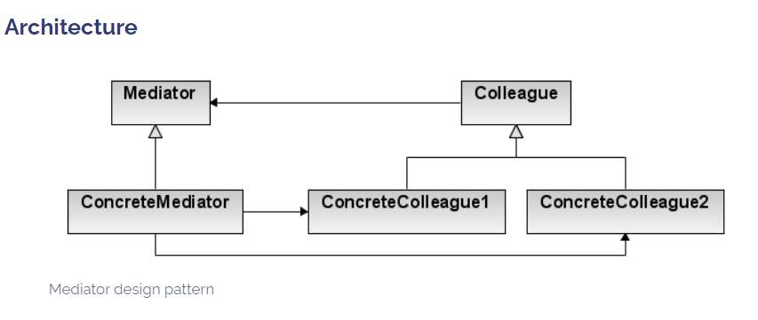

###Mediator

Define an object that encapsulates how a set of objects interact. Mediator promotes
loose coupling by keeping objects from referring to each other explicitly, and
it lets you vary their interaction independently.

Object-oriented design encourages the distribution of behavior among objects. Such
distribution can result in an object structure with many connections between
objects; in the worst case, every object ends up knowing about every other.

###Builder

#####Applicability
Use the Mediator pattern when
- a set of objects communicate in well-defined but complex ways. The resulting
interdependencies are unstructured and difficult to understand.
- reusing an object is difficult because it refers to and communicates with
many other objects.
- a behavior that's distributed between several classes should
be customizable without a lot of subclassing.

#####Consequences
The Mediator pattern has the following benefits and drawbacks:
1. It limits subclassing. A mediator localizes behavior that otherwise would
   be distributed among several objects. Changing this behavior requires
   subclassing Mediator only; Colleague classes can be reused as is.
2. It decouples colleagues. A mediator promotes loose coupling between
   colleagues. You can vary and reuse Colleague and Mediator classes
   independently.
3. It simplifies object protocols. A mediator replaces many-to-many
   interactions with one-to-many interactions between the mediator and its
   colleagues. One-to-many relationships are easier to understand, maintain,
   and extend.
5. It centralizes control. The Mediator pattern trades complexity of
   interaction for complexity in the mediator. Because a mediator encapsulates
   protocols, it can become more complex than any individual colleague. This
   can make the mediator itself a monolith that's hard to maintain. 

#####D from SOLID
D - Dependency Inversion Principle (Entities must depend on abstractions, not on concretions.)
