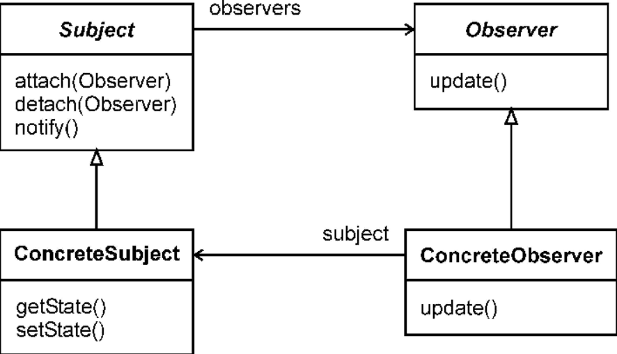

###Observer
Define a one-to-many dependency between objects so that when one object changes
state, all its dependents are notified and update dautomatically.

#####Applicability
Use the Observer pattern in any of the following situations:

- When a change to one object requires changing others, and you don't know
how many objects need to be changed.
- When an object should be able to notify other objects without
making assumptions about whom these objects are. In other words, you don't want
these objects tightly coupled.

#####Consequences
The Observer pattern lets you vary subjects and observers independently. You can
reuse subjects without reusing their observers, and vice versa. It lets you add
observers without modifying the subject or other observers.

Further benefits and liabilities of the Observer pattern include the following:
1. **Abstract coupling between Subject and Observer.** -> All a subject knows is that
   it has a list of observers, each conforming to the simple interface of the
   abstract Observer class. The subject doesn't know the concrete class of any
   observer. Thus, the coupling between subjects and observers is abstract and
   minimal.

2. **Support for broadcast communication.** -> Unlike an ordinary request, the
   notification that a subject sends needn't specify its receiver. The
   notification is broadcast automatically to all interested objects that
   subscribed to it. 

3. **Unexpected updates.** -> Because observers have no knowledge of each other's
   presence, they can be blind to the ultimate cost of changing the subject.
   A seemingly innocuous operation on the subject may cause a cascade of updates
   to observers and their dependent objects. Moreover, dependency criteria that
   aren't well-defined or maintained usually lead to spurious updates, which
   can be hard to track down.
   This problem is aggravated by the fact that the simple update
   protocol provides no details on what changed in the subject.
   Without additional protocol to help observers discover what changed, they
   maybe forced to work hard to deduce the changes.

##### D from SOLID
D - Dependency Inversion Principle (Entities must depend on abstractions, not on concretions.)