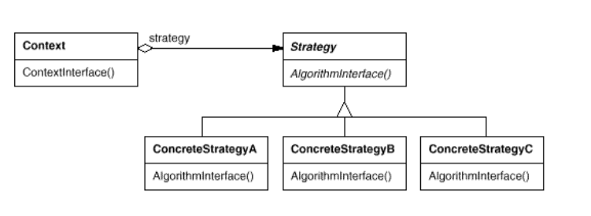

###Strategy 

Define a family of algorithms, encapsulate each one, and make them interchangeable.

Strategy lets the algorithm vary independently of clients that use it. 

Also Known As : Policy 

#####Applicability
Use the Strategy pattern when
- many related classes differ only in their behavior. Strategies provide a
way to configure a class with one of many behaviors.
- you need different variants of an algorithm. For example, you might
define algorithms reflecting different space/time trade-offs.
- an algorithm uses data that clients shouldn't know about. Use the Strategy
pattern to avoid exposing complex, algorithm-specific data structures.
- a class defines many behaviors, and these appear as multiple conditional
statements in its operations. Instead of many conditionals, move related
conditional branches into their own Strategy class.

#####Consequences
The Strategy pattern has the following benefits and drawbacks:

1. **Families of related algorithms.** -> Hierarchies of Strategy classes define a
   family of algorithms or behaviors for contexts to reuse. Inheritance can help
   factor out common functionality of the algorithms.
2. **An alternative to subclassing.** -> Inheritance offers another way to support
   a variety of algorithms or behaviors. You can subclass a Context class
   directly to give it different behaviors. But this hard-wires the behavior
   into Context. It mixes the algorithm implementation with Context's, making
   Context harder to understand, maintain, and extend. And you can't vary
   the algorithm dynamically. You wind up with many related classes whose only
   difference is the algorithm or behavior they employ. Encapsulating the
   algorithm in separate Strategy classes lets you vary the algorithm
   independently of its context, making it easier to switch, understand, and
   extend.
3. **Strategies eliminate conditional statements.** -> The Strategy pattern offers
   an alternative to conditional statements for selecting desired behavior.
   When different behaviors are lumped into one class, it's hard to avoid using
   conditional statements to select the right behavior. Encapsulating the
   behavior in separate Strategy classes eliminates these conditional
   statements.

##### SOLD from SOLID
S - Single responsibility principle (a class should have one and only one reason to change)

O - Open-Closed principle (Open for extension, closed for modification)

L - Liskov substitution (Subtypes can replace their types)

D - Dependency Inversion Principle (Entities must depend on abstractions, not on concretions.)

